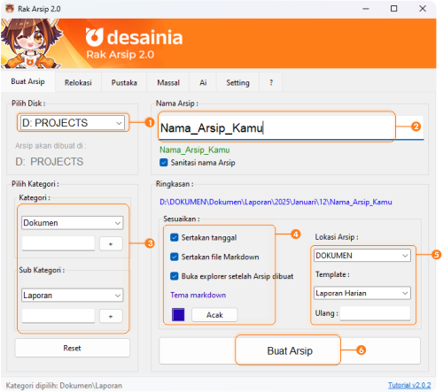
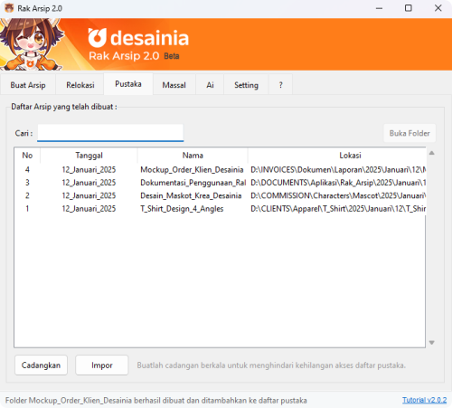
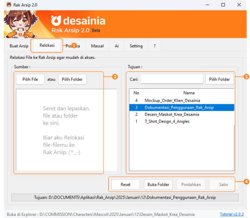

# Panduan Pembuatan Arsip Baru.

## Ringkasan :

Pernah merasa repot sama tumpukan folder yang berantakan di komputer? 

Nah, `Rak Arsip` hadir untuk membantu kamu! Aplikasi ini bakal bikin hidup kamu lebih mudah dengan mengelola file dan folder secara sistematis. Nggak perlu lagi deh bikin folder bersarang (folder di dalam folder) secara manual. Semua proses pembuatan folder akan ditangani oleh `Rak Arsip`. Jadi, kamu bisa lebih fokus ke pekerjaan dan santai sejenak tanpa pusing mikirin folder-folder itu.

## Instalasi Aplikasi :
  1. Unduh `Rak Arsip` versi terbaru di [sini](https://github.com/mudrikam/Rak-`Arsip`-2/releases)
  2. Install **Rak.Arsip.v2.Setup.exe**, dan ikuti langkahnya hingga selesai.
  3. Untuk versi portable unduh **Rak.Arsip.v2.Portable.zip**

---

## Memulai Aplikasi :
   1. Setelah instalasi maka aplikasi `Rak Arsip` dapat dibuka melalui windows - menu start. (pin ke taskbar jika sering digunakan).
   2. Ekstrak **Rak.Arsip.v2.Portable.zip** lalu klik dua kali pada **Rak Arsip 2.0.exe** jika menggunakan versi *portable*. Ekstrak dapat menggunakan winrar, 7zip atau bisa juga dengan klik kanan - Extract All ke folder tujuan kamu.
   3. Perhatikan status bar untuk informasi mengenai tindakan. (pojok kiri bawah).

---

## Membuat Arsip / Folder

### 1. Memilih Disk :

  - Pilih disk tujuan di mana `Arsip` akan disimpan, `Rak Arsip` akan memindai komputer kamu untuk mendapatkan daftar disk yang tersedia.

### 2. Masukkan Nama Arsip / Dokumen :

  - Ketikkan nama `Arsip`, Dokumen, Proyek atau apapun kamu menyebutnya.
  - Spasi akan diganti dengan garis bawah (`_`) dan karakter spesial akan dihilangkan jika Sanitasi nama `Arsip` diaktifkan.
  - Hindari karakter spesial seperti `\ / : * ? " < > |`.
  - Gunakan nama yang deskriptif seperti : _`"Laporan Penjualan Buku"`_, _`"Pembayaran Klien A Proyek A"`_, _`"Tugas Membuat Kerajinan Bambu"`_, dan nama lain yang mudah diingat.

### 3. Kategori & Sub Kategori :

  - Tambahkan kategori baru dengan mengetikkan nama kategori utama pada kolom Kategori, lalu tekan enter atau klik tombol [+] di sebelahnya.
  - Sub Kategori dapat ditambahkan setelah memilih kategori utama dengan cara yang sama.
  - Kategori dapat dipilih ketika kamu sudah menambahkan kategori baru.

### 4. Penyesuaian Tambahan
  - Terdapat empat penyeseuaian yang dapat kamu lakukan yaitu :
    1. Sertakan tanggal : untuk membuat `Arsip` berada dalam tanggal hari ini.
    2. Sertakan file markdown : file markdown adalah file yang berektensi `.md` pada `Arsip` yang baru kamu buat. File ini ditujukan untuk melacak dan merekap file menggunakan aplikasi seperti [Obsidian](https://obsidian.md/) atau [Logseq](https://logseq.com/). *(Nonaktifkan jika kamu tidak membutuhkan file ini)*. 
    3. Kamu juga dapat memilih tema markdown pada tombol berwarna berbentuk kotak kecil atau memilih acak.
    4. Buka explorer setelah `Arsip` dibuat akan membuka explorer ke arah folder yang baru saja dibuat jika aktif.

### 5. Pilih Lokasi dan Template

  - Pilih lokasi `Arsip`. Setelah aplikasi memindai disk yang tersedia pada komputer kamu, aplikasi `Rak Arsip` akan menggunakan folder pertama yang ada pada disk itu sebagai folder akar (root). Misalnya dalam disk _`D: PROJECTS`_ terdapat folder _`Dokumen, Laporan, Invoice, Film, dll.`_ maka akan dimuat dan dijadikan pilihan pada dropdown.
  - Pilih template jika ingin membuat sub folder secara otomatis di dalam `Arsip` kamu. Misalnya jika kamu memiliki _`D:PROJECTS/Dokumen/Kategori/Sub_Kategori/2025_Januari_1/Nama_`Arsip`_Kamu`_. Maka daftar sub folder yang kamu tambahkan pada template akan dibuatkan secara otomatis setiap kali membuat `Arsip`. Hasil akhir mungkin akan seperti _`D:PROJECTS/Dokumen/Kategori/Sub_Kategori/2025_Januari_1/Nama_`Arsip`_Kamu/sub folder 1, sub folder 2, sub folder 3, dst.`_
  - Jika kamu menginginkan `Arsip` untuk dibuat lebih dari satu kali maka masukkan jumlahnya ke kolom `Ulangi`, jumlah yang kamu masukkan akan menjadi acuan untuk `Rak Arsip` membuatkan berapa banyak folder. Kosongkan jika hanya ingin membuat sekali.
  - Template dapat disesuaikan pada tab `Setting` - `Template`

### 6. Buat Arsip

  Setelah semuanya selesai diatur, klik tombol **Buat Arsip**. `Rak Arsip` akan mulai membuat folder dan sub folder sesuai dengan pengaturan yang telah kamu tentukan. Proses ini biasanya memakan waktu singkat tergantung pada jumlah dan kompleksitas folder yang dibuat.

  Setelah proses selesai, kamu akan melihat notifikasi di status bar(pojok kiri bawah) yang menginformasikan bahwa `Arsip` telah berhasil dibuat. Kamu sekarang bisa mulai mengisi folder tersebut dengan dokumen dan file yang kamu butuhkan.

  `Arsip` yang telah kamu buat akan tercatat pada daftar Pustaka sehingga akan memudahkan kamu untuk mengaksesnya kembali di kemudian hari.

*tips : klik dua kali pada daftar yang kamu pilih untuk membuka folder dengan cepat.*

  Selamat! Kamu telah berhasil membuat `Arsip` dengan `Rak Arsip`.

---

# Panduan Relokasi File ke Rak Arsip

Setelah kamu berhasil membuat `Arsip` untuk menyimpan dokumen kamu, selanjutnya kamu bisa memindahkan file-file yang sudah ada ke dalam `Arsip` tersebut. Berikut adalah langkah-langkah untuk merelokasi file ke `Rak Arsip`:

## Langkah-langkah Relokasi File:

### 1. Buka Tab Relokasi
  Kamu dapat merelokasi file yang kamu miliki ke folder yang sudah dibuatkan `Rak Arsip` dengan mudah melalui tab Relokasi(setelah tab **Buat Arsip**).

### 2. Pilih Sumber :
  - Pilih file yang ingin kamu pindahkan atau salin ke `Rak Arsip` dengan klik tombol `Pilih File` atau `Pilih Folder`. Kamu juga dapat memilih file dengan seret dan lepaskan file ke area yang sudah disediakan.
  - Kamu dapat memilih banyak sumber sekaligus untuk dimasukkan ke `Rak Arsip`.

### 3. Pilih Tujuan :
  - Pilih tujuan melalui daftar yang sudah tersedia pada tabel, tabel ini berisi semua daftar `Arsip` yang telah kamu buat menggunakan `Rak Arsip`.
  - Jika kamu ingin memilih tujuan lain, kamu dapat melakukannya dengan klik tombol `Pilih Folder` pada pojok kanan atas. File pada daftar sumber akan direlokasi ke tujuan sesuai pilihan kamu. *Harap diperhatikan jika kamu memilih melalui tombol `Pilih Folder` maka lokasinya tidak akan tercatat di `Rak Arsip`.*
  - Kamu dapat mengetikkan kata kunci mengenai `Arsip` kamu di kolom pencarian untuk menemukan lokasi tujuan kamu.

### 4. Konfirmasi Relokasi :
  - Tentukan apakah kamu ingin memindahkan, menyalin, atau hanya ingin membuka folder tujuan. Jika kamu ingin mengulang langkahnya dari awal, kamu hanya perlu klik tombol `Reset`.

### Selesai.
  Setelah proses relokasi selesai, kamu akan melihat notifikasi di status bar (pojok kiri bawah) yang menginformasikan bahwa file telah berhasil direlokasi.

  Selamat! Kamu telah berhasil merelokasi file melalui `Rak Arsip`. Dengan fitur ini, kamu bisa lebih mudah mengelola dan mengatur dokumen-dokumen penting kamu.

